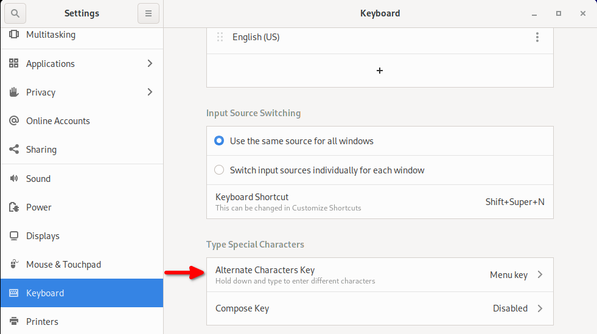

# Right Alt Key Not Working in Emacs (GNOME)

## Problem

The right Alt key acts as `ISO_Level3_Shift` (AltGr) instead of Meta, so Emacs keybindings like `M-x` don't work. This is caused by GNOME's **Alternate Characters Key** setting being set to Right Alt.

`xev` confirms the key is captured as `ISO_Level3_Shift` instead of `Alt_R`:

```
KeyRelease event, serial 37, synthetic NO, window 0x3200001,
    root 0x622, subw 0x0, time 5314450, (2000,230), root:(2050,349),
    state 0x90, keycode 108 (keysym 0xfe03, ISO_Level3_Shift), same_screen YES,
    XLookupString gives 0 bytes:
    XFilterEvent returns: False
```

## Solution

Go to **Settings → Keyboard → Type Special Characters → Alternate Characters Key** and change it from "Right Alt" to something else (e.g. "Menu key" or disabled).


